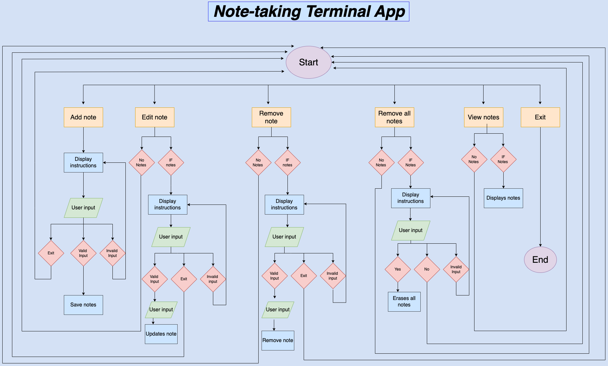

# Note-Taking App

## Git Repo
[Access my project in GitHub](https://github.com/Jessicavazm/Terminalapp_JessicaVaz.git)

## Dependencies
Dependencies used to run the application includes:
- colorama==0.4.6
- iniconfig==2.0.0
- packaging==24.1

## App features, how to use the app
In this part, I will detail how to use the app, and describe features of the `note-taking` app.

Once the app is open, it prints a welcome message and an important information about notes. Each notes is printed with a index which will be used for editing and removing a note. All notes are printed with current date and time when they were created.

Main menu contains `6 different options` that are printed in different colours to help with visibility and to add styling. Package `colorama` is used through the whole program and it's listed on requirements.txt file.
While loop is used through program to create a continuously interaction with user. If/else statements directs the flow of the program and Try/Except blocks are used for error handling, allowing the program to run without breaking. Try contains the blocks of codes that an error might occur and except contains codes that handles the errors. I'll explain more in details in functions features.

```
Terminal application adheres to PEP 8 styling guide.
Comments are placed on code to indicate functions/ features.
```

## How to use the app:

```
 Steps to run the application:
 1 step 
 2
 3

 Go to the source file "JessicaVazMartins_T1A3/src" and then run by writing "./run.sh" in the terminal. It should run the application in the terminal.
 Dependencies are automatically installed.

```
In all menu options you can press 'exit' escape function and go back to main menu.

Add a note:
Press option 1
Enter each note in a new line 
Go to a new line and type 'done' to save notes

Edit a note:
Press option 2
Type note index number (index number is on the left side on the note).
Type new content for note and press enter to save

Remove a note:
Press option 3
Type note index number (index number is on the left side on the note).

Remove all notes:
Press option 4
Type "yes" to continue with execution or "no" to cancel and go back to main function.

View notes:
Press option 5
Saved notes will be displayed along index number, date and time when they were created.

Exit:
Press option 6


```


```
How colorama is used in the note app:

Green colour: Used when asking for user input and to print confirmation messages when a function was executed successfully.
Yellow colour: Used for printing messages that indicates function can't be executed and prompts user to do something for function to work.
Red colour: Used to print Errors messages that program came across while running.
```

```
Number 1: User can add a note
Number 2: User can edit a note
Number 3: User can remove a note
Number 4: User can remove all notes
Number 5: User can view notes
Number 6: User can exit the program
```

- Option number 1 (Add note):
    - With this feature, user is able to add notes to the note-taking application. User can choose to add an individual note or add multiple notes. `Function_add` note first calls `load_notes_json` and stores all saved notes to a variable called `notes`. Variable `initial_count` stores the number of items in the `notes` list. 

    - Print function displays message that prompt the user to type each note in a single line and once they finish, type `done` on a new line to save notes to note app or type `exit` to cancel and go back to main menu. Variable `timestamp` receives the value of current day/time which is acquired by importing datetime built-in module from Python's Library.

    - Program enters a `while True` loop. Function `.lower` converts all characters to lower case, and `.strip` removes extra spaces from the beginning and end of a string. Variable `i` is assigned the value of user input. `If` condition checks if `i` value is `done` or `exit` and if condition matches, the function ends. `If not` inverts the condition boolean value, so if the string is empty this statement will evaluate to true and the message will indicate note can't be an empty note and prompt the user to type content for the note. `Continue` keeps the loop running. `Else` condition evaluates to true if none of the conditions above were executed it uses the `append` function to add `note_text` and `timestamp` variables to `notes` list.

    - `If` uses comparison operation `>` to check if number of items in `notes` list is greater than `initial_count` value, if condition evaluates to true, it calls the function `save_notes_json` to add notes to json file and prints a message confirming that notes have been successfully added to note app.
    Function `view_notes` is called to allow users to see the update note list. If none of the conditions above evaluate to true, `else` is called to indicate to user that no notes were added. 

    - except `ValueError` is called when the function receives a attribute with the wrong value.
    - except `Exception` catches any possible error that might occur in the program's execution.

- Option number 2 (Edit note):
    - Function `edit_note` first calls `load_note_json` and stores existing notes in variable `notes`. `If not` checks if note app has any notes to edit. If it evaluates to true, it displays a message that indicates the note app is empty and prompts the user to first add a note. `Return` ends the function since it can't proceed. If condition evaluates to false, `view_notes` function is called and displays existing notes for user. 
    
    - Loop `while True` runs until user types a valid input or chooses to exit the program. User input is stored in variable called `i`. `If` checks if `i` value is == to `exit` and if it evaluates to true, the loops ends. Variable `timestamp` receives the value of current day and time. Variable `i` is converted to integer and assigned new value. `If` checks if user input is within the valid range => 1 and <= len(notes),if it evaluates to true, `else` statement will be printed indicating incorrect index. If condition evaluates to true, user is asked to type new content for note and changes are stored in variable `new_note`. `If` new_note verifies the `new_note` is not an empty string and updates the note with new content and new date/time. Function `save_notes_json` is called to update json file. Function `print` displays a message confirming the process has been successful and loop is ended. If `new_note` hasn't been executed, `else` statement prints a message indicating note cannot be empty, and it continue the loop.

    - Except `ValueError` catches wrong input values and `exception` catches any other possible error that might occur in the program's execution.
    
- Option number 3 (Remove note):
    - Function `remove_note` first calls function `load_notes_json` from file_operation module and assigns value variable `notes`. `If not` checks if `notes` is empty, if it evaluates to true it prompts the user to add a note first and `return` ends the function and goes back to main mene otherwise function `view_notes` is called and displays list of notes.
    
    - Loop `while True` runs until user enters a valid input or decides to exit. User input is stored in variable `i`. If first checks if `i` value equals to `exit`, condition becomes true and program breaks the execution. Variable `i` converts user input to integer and assign values back to variable `i`. If `i` is =>1 and <= items in the notes list , function `pop` removes note using (i - 1) -1 is necessary note items are displayed with index 1 instead of 0. Function `save_notes_json` is called to update changes and afterwards a confirmation message is displayed and function `view_notes` is called so user can see changes made to their note app, if note app is empty, app prompts user to add a new note. Program exits to main function after this. `Else` statement is called if the statement above wasn't called and index number was out of the range, it displays a message indicating to user index number is wrong and to check index which is displayed next to printed notes.
    
    - `ValueError` catches wrong values passed to function and `exception` catches any possible error that might occur in the execution process.

- Option number 4 (Clear all notes):
    - Function allows user to delete all notes at once. Function `clear_note` first calls function `load_notes_json` from file_operation module and assigns value variable 'notes'. `If not` checks if note app is empty, if it evaluates to true it indicates to user notebook is empty and prompts user to add a note first. `Return` ends the function since it cannot proceed.

    - Function `clear_notes` enters a `while True` loop if note app contains notes, variable `i` stores user input which is used to be evaluated with `if/elif` statements. User is prompt to confirm if they want to proceed with the function and they are advised action cannot be undone. If user confirms, notes are erased using `clear` function. Function `save_notes_json` is called to update note app. If user decides to cancel function, return is called and it exits back to main menu. `Else` statement is called if none of the above evaluates to true and it indicates user input is invalid and the loop continues asking the user again for a confirmation to delete notes.

- Option number 5 (View Notes):
    - Function view_notes first calls function `load_notes_json` from file_operation module and assigns value variable `notes`. `If not` checks if note app is empty, if it evaluates to true, it displays a message indicating the app is empty and it prompts the user to add a note first. `Return` ends the function since it cannot proceed.

    - `For` and `in` iterates over each item in the list `notes` and it assigns each item with an index number starting from number 1. Print function prints all notes stored in the variable notes along date/time and index number.

    - `Exception` catches any possible error that might occur in the process.

- Option number 6 (Exit):
    - This option lets user end the program, it prints a message thanking the user for visiting the app.

### Main function
    - Imports Colorama package for printing in colour
    - Imports app_functions module to use it's functions.

- `Main` function enter a `while True` that keeps executing the main menu until user types a valid input or decides to exit program. Print function displays the app's menu with 6 different options. Each option calls a specific function from module `app_functions`. User input is stored in a variable called `user_choice` and `if/elif` statements are then executed. If any of the statement evaluates to true, corresponding function is called. Else statement is called if none of the conditions above is true indicating user input is invalid and prompts the user to type the desired menu option again.

- `KeyboardInterrupt` displays an error message when user interrupts the flow of the program by typing control + c.
- `Exception` catches any other error that might occur in the program process.

- `Finally block` is always displayed regardless if an error was raised in the try block or not. Message informs any added note will be saved for next time. 

### File handling functions
`Save_note_json` and `load_notes_json` imports built in modules `json and os` from Python library to handle file operations.

- Function `save_note_json` opens the file in `w` (write mode) and save all changes to file using function `dump`.json'. `With` statements makes sure the file is close after changes are done and it prints a message confirming changes to json file. 

- `Except` catches errors in the execution of the progress.
    - FileNotFoundError: program couldn't find the json file.
    - IOError: Errors that occur during Input/Output operations.
    - Exception: catches any other errors that might occur.


- Function `load_notes_json` checks if the specified file exists using `os.path.exist` from `os` python's library.`If` os.path.exist evaluates to true, `with open` tries to open the file in `r` reading mode. Content from json file is stored in variable `notes` and `return` returns value to `notes`.

- `Except` catches errors in the execution of the progress.
    - FileNotFoundError: program couldn't find the json file.
    - JSONDecodeError: Invalid json data
    - IOError: Errors that occur during Input/Output operations.
    - Exception: catches any other errors that might occur.
 



# Pseudo-code
App that stores user notes along day/time when notes were created. App allows users to add multiple notes at once, edit, remove and view notes.

`def Main function():`

    while True:
        Print(Display welcoming message and menu options)
        
        try:
        Asks for user choice from menu options

            if user choice == "1":
                Call add_note from app_function module
            elif user choice == "2":
                Call edit_note from app_function module
            elif user choice == "3":
                Call remove_note from app_function module
            elif user choice == "4":
                Call clear_notes from app_function module
            elif user choice == "5":
                Call view_notes from app_function module
            elif user choice == "6":
                break
            else:
                print(Indicates user's input is invalid)
    
        except KeyBoardInterrupt:
            print(Error message)
            break

        except Exception:
            print(Error message)

        finally:
            print(Message that informs users all added notes will be saved to next time)


`def Add function():`

    load notes
    initial_count = length of notes

    try:
        print(Instructions for adding a note or exit to go back to main menu)
        timestamp = current date and time

        while True loop:
            i = input()
            if i.lower().strip() in ['done', 'exit']:
                break
            if not i.strip():
                print (Message about possible error and instructions for user to solve issue)
                continue
            else:
                save notes to app with date/time

        if length of notes > initial_count:
            fo.save_notes_json(notes)
            print (Confirmation message)
            view_notes()
        else:
            print (Message indicates no notes were added)

    except ValueError as ve:
        print (Error message {ve})

    except Exception as e:
        print (Error message {e})


`def Edit function():`
    
    load notes

    if not notes:
        print (Instruct user to add a note first)
        return

    view_notes()

    while true loop:
        i = input(Asks user what index note they want to edit or exit to go back to main menu)
        if i.lower() == "exit":
            break

        try:
            timestamp = current date and time
            i = integer value of i
            if i >= 1 and i <= len(notes)::
                new_note = input(Asks user for new note content).strip()
                if new_note:
                    notes[i - 1] = (new_note.strip(), timestamp)
                    save note to json file
                    print (Confirmation message)
                    view_notes()
                    break
                else:
                    print(Indicates user input is not valid, and instruct user to check index number again)
                    continue
            else:
                print (Indicate wrong index number )

        except ValueError:
            print (Wrong value, it displays possible value to user)

        except Exception as e:
            print(Error message {e})


`def Remove notes Function():`

    loads notes
    
    if not notes:
        print(Indicates users note app is empty, instruct user to add a note)
        return

    view_notes()
    
    try:
        while True loop:
            i = input(Asks for note index user wants to remove or exit to go back to main function).strip()
            if i.lower() == "exit":
                break
            try:
                i = convert value of variable i to integer
                if i >= 1 and i <= len(notes):
                    removes note
                    save notes to json file
                    print(Confirmation message)
                    view_notes()
                    break
                else:
                    print(Indicates incorrect index)
            except ValueError:
                print(Wrong value, it displays possible values to user)
    
    except Exception as e:
        print(Error message {e}")


`def Clear notes Function():`

    load notes

    if not notes:
        print(Indicates note app is empty and prompts user to add a note)
        return

    while True:
        i = input(Displays a message asking if user wants to go ahead with function or wants to exit)

        try:
            if i == "yes":
                clear notes
                saves not
                print(Confirmation message)
                return  
            elif i == "no":
                print(Prints a message confirming clear function was not performed, it goes back to main menu)
                return  
            else:
                print(Indicates invalid input)
        except Exception as e:
            print(Error message {e}")


`def View notes Function():`
    
    loads notes
    if not notes:
        print(Indicates note app is empty, it prompts user to first add a note)
        return

    try:
        prints each item of a list with index number starting from 1 using enumerate function.       

    except Exception as e:
            print(Error message{e}")


`def Save notes Function:`
    
    try:
        with open(filename, "w) as file:
            json.dump(file)
            print(Confirmation message)
    
    except FileNotFoundError as fe:
        print(Message error {fe})
        
    except IOError as ie:
        print(Message error {ie})

    except Exception as e:
        print(Message error {e}")


`def Load notes Function ():`
    
    if os.path.exists(filename):
        try:
            with open(filename, "r") as file:
                notes = json.load(file)
                return 
        
        except FileNotFoundError as fe:
            print(Error message: {fe})
       
        except json.JSONDecodeError as de:
            print(Error message: {de})

        except IOError as ie:
            print(Error message: {ie})

        except Exception as e:
            print(Error message {e}")
    else:
        print(Indicates file does not exist)


## Trello Board
[Access my project in GitHub](https://trello.com/b/oCKtnWGF)


